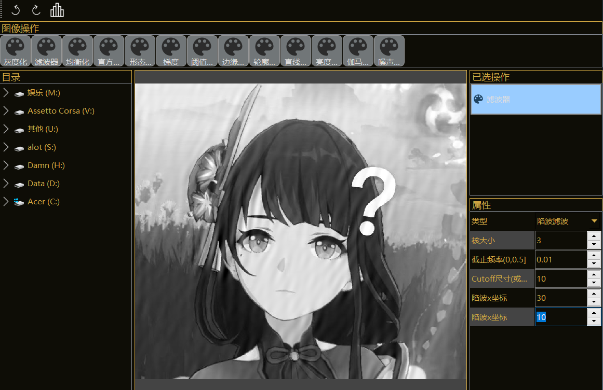
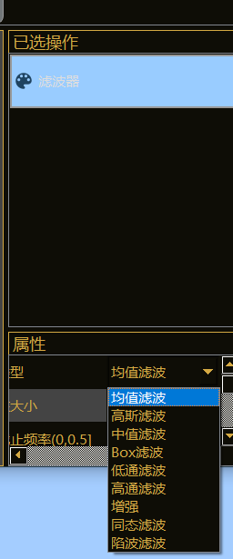
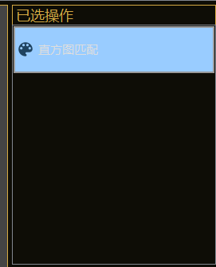
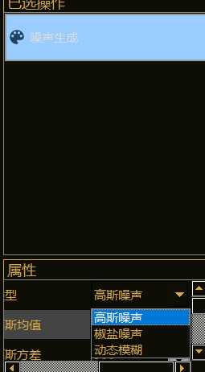
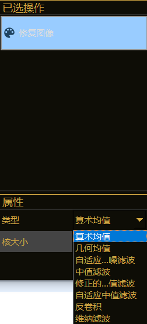
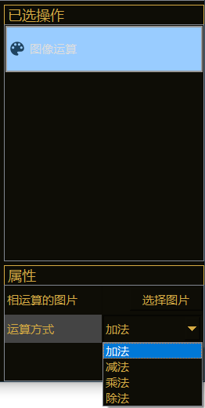
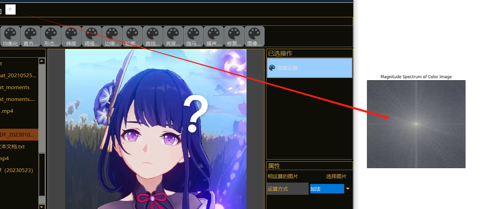

# opencv-pyqt5
使用opencv与pyqt5实现的图像处理程序

# Dependency
* opencv-python
* matplotlib
* pyqt5

## 已实现功能
* 图像旋转
* 转灰度图
* 图像平滑
* 直方图均衡化
* 形态学操作
* 梯度计算
* 阈值处理
* 边缘检测
* 轮廓检测 
* 哈夫变换直线检测
* 亮度调节
* 伽马校正

## 2024/11/02 克隆仓库并加入课程设计需要内容

### 图像平滑部分
  添加了Box滤波，低通、高通滤波，拉普拉斯增强，同态滤波，陷波滤波   

### 增加直方图匹配
  
### 增加噪声生成
  

## 2024/11/02 再增功能
### 图像修复
  
### 图像运算
  
### 频谱图显示
  
    
